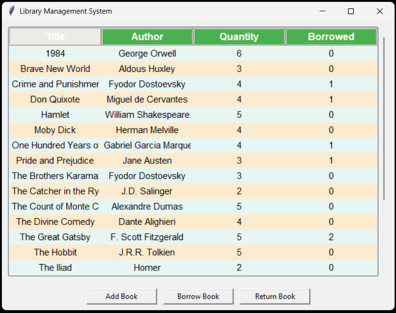
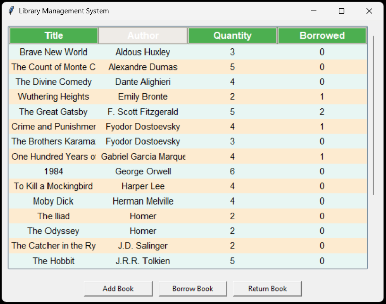
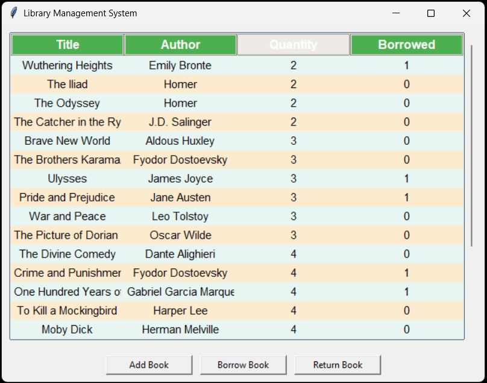
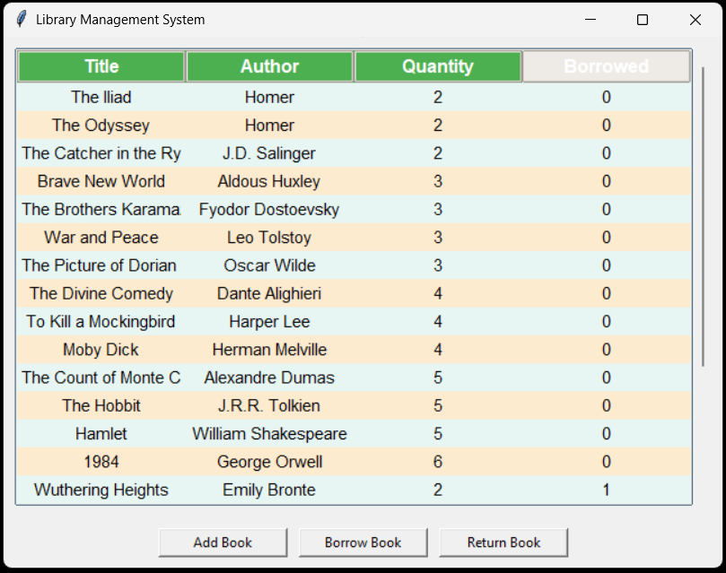

# 📚 Library Management System

A simple **Library Management System** developed in **Python** to help users efficiently manage books, users, and lending/return operations.

This project is designed for **learning purposes** and small-scale library management.

---

## 🛠 Features

- Add, update, delete, and list **books**  
- Manage **lending and return operations**  
- **GUI support** for user-friendly interface (using Tkinter)  
- Track **book availability**

---

## 💻 How it Works

The system uses a **console-based and/or GUI interface** where users can:

1. Add or update books  
2. Record book lending and return operations  
3. View all books and users  
4. Check the availability of books  

---

## 🖼 Screenshots

<table>
<tr>
<td></td>
<td></td>
</tr>
<tr>
<td></td>
<td></td>
</tr>
</table>

---

## ⚡ Future Improvements

- Implement **user accounts and login system**  
- Add **search and filter options** for books and users  
- Export library data to **CSV or PDF**  
- Improve **GUI with more interactive features**
