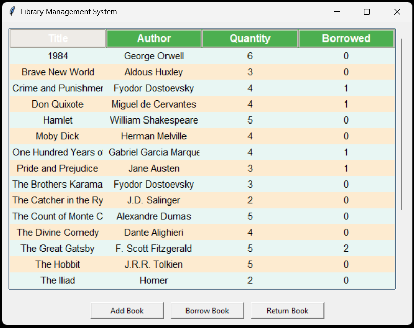
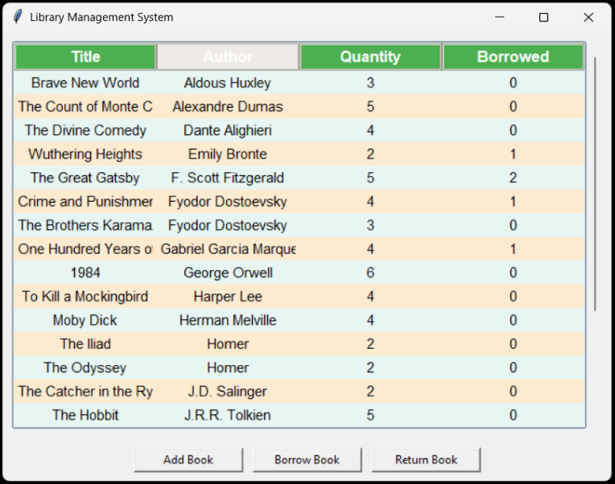
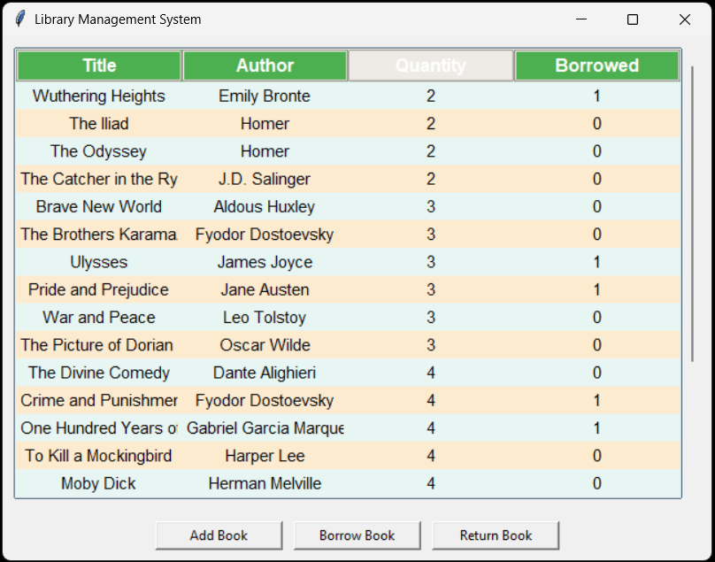
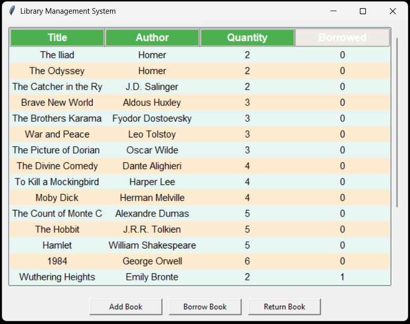

# 📚 Library Management System - 2

A simple **Library Management System** developed in **Python** to efficiently manage books, users, and borrowing processes.

This project is designed for learning purposes and small-scale library management.

---

## 🛠 Features

- Add, remove, and update books  
- Track borrowed and returned books  
- Sort books by title or author  

---

## 📖 How it Works

The system uses a **console-based interface** where library staff can:

1. Add new books to the library catalog  
2. Borrow and return books  
3. View all books and their status  
4. Sort all books by different criteria  

---

## 📷 Guide

Below is a simple guide for using the system:

<p align="center">
  
  
  
  
</p>

---

## 💻 Installation

1. Clone the repository:
```bash
git clone https://github.com/yourusername/library-management-system-2.git

